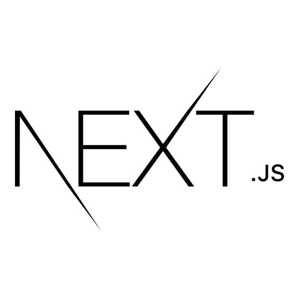

##  Hi, I'm Ly Le Thi Cam — Fresher Developer

---

<a href="https://github.com/lylethic" target="_blank">
  
</a>

---

### About Me

> Entry-level Web Developer proficient in JavaScript, React.js, Next.js, and TypeScript, with 1+ year of hands-on experience through E-commerce
and CRM projects. Skilled in building interactive user interfaces, integrating RESTful APIs, and optimizing application performance. Seeking a Fresher Web Developer role to apply React expertise to production-grade products and grow within a professional development team.

|               |                                                       |
| :------------ | :---------------------------------------------------- |
| **Location**  | Binh Minh, Dong Nai, Vietnam | Go Vap, GCMC           |
| **Education** | Information Technology Graduated                      |
| **Focus**     | Backend Development · API Design · System Integration |

---

### Work Experience

`**Back-End Developer**` | May 2025 - Jul 2026

**Company:** VietProDev Software Co., Ltd (L5-5, Phu Gia 2 Residential Area, Dong Nai, Vietnam.)

- Developed and maintained RESTful APIs using ASP.NET Core, supporting core **E-commerce and CRM system** features; improved backend scalability and code maintainability.
- Optimized SQL queries with indexing and query tuning, **reducing average API response time from ~2,000ms to ~600ms (~70% improvement)**, directly enhancing user-facing page performance.
- Built and integrated APIs for affiliate marketing campaign configurations and a real-time user feedback system with OneSignal push notification delivery.
- Refactored legacy backend code and database queries, achieving a 20% overall system performance improvement.
- Collaborated on Frontend tasks using React.js and Next.js for internal portal dashboards, contributing to responsive UI and data visualization components.
- Leveraged Claude Code and OpenAI Codex to automate boilerplate generation, and refactoring, reducing time spent on repetitive development tasks.

Technologies: `C#, ASP.NET Core, Node.js (Express.js), SQL Server, PostgreSQL, Socket.io, Sequelize ORM, Git, Postman...`


### Tech Stack

| Category      | Technologies                                             |
| :------------ | :----------------------------------------------          |
| **Languages** | C#, JavaScript, Python, TypeScript                       |
| **Backend**   | .NET Core (ASP.NET), Node.js (Express), FastAPI          |
| **Frontend**  | React, Next.js (Basic), HTML, CSS, TailwindCss, Bootstrap|
| **Database**  | SQL Server, MongoDB, PostgreSQL                          |
| **Tools**     | Docker, Git, Postman, Codex, Claude AI                   |

---

<h3 align="left">🛠 Languages and Tools: 🛠</h3>
<table><tr>
<td align="center"><a href="https://www.w3schools.com/cs/" target="_blank" rel="noreferrer"></a></td>
<td align="center"><a href="https://developer.mozilla.org/en-US/docs/Web/JavaScript" target="_blank" rel="noreferrer"></a></td>
<td align="center"><a href="https://www.typescriptlang.org/" target="_blank" rel="noreferrer"></a></td>
<td align="center"><a href="https://www.python.org/" target="_blank" rel="noreferrer"></a></td>
<td align="center"><a href="https://dotnet.microsoft.com/" target="_blank" rel="noreferrer"></a></td>
<td align="center"><a href="https://expressjs.com" target="_blank" rel="noreferrer"></a></td>
<td align="center"><a href="https://git-scm.com/" target="_blank" rel="noreferrer"></a></td>
<td align="center"><a href="https://www.microsoft.com/en-us/sql-server" target="_blank" rel="noreferrer"></a></td>
<td align="center"><a href="https://fastapi.tiangolo.com/" target="_blank" rel="noreferrer"></a></td>
<td align="center"><a href="https://nextjs.org/" target="_blank" rel="noreferrer"></a></td>
<td align="center"><a href="https://nodejs.org" target="_blank" rel="noreferrer"></a></td>
<td align="center"><a href="https://reactnative.dev/" target="_blank" rel="noreferrer"></a></td>
<td align="center"><a href="https://redux.js.org" target="_blank" rel="noreferrer"></a></td>
<td align="center"><a href="https://tailwindcss.com/" target="_blank" rel="noreferrer"></a></td>
<td align="center"><a href="https://getbootstrap.com" target="_blank" rel="noreferrer"></a></td>
<td align="center"><a href="https://www.w3.org/html/" target="_blank" rel="noreferrer"></a></td>
<td align="center"><a href="https://www.w3schools.com/css/" target="_blank" rel="noreferrer"></a></td>
</tr></table>

---
<h3 align="left">🛠 AI Tools: 🛠</h3>
<table><tr><td align="center"><a href="https://claude.ai/" target="_blank" rel="noreferrer"></a></td>
<td align="center"><a href="https://gemini.google.com/app" target="_blank" rel="noreferrer"></a></td>
<td align="center"><a href="https://openai.com/codex/" target="_blank" rel="noreferrer"></a></td></tr></table>
---


### Projects

#### `CRM Platform` — Backend Developer (Node.js/Express.js) (Apr 2026 - Present)

Description: A multi-channel CRM system enabling businesses to manage customers, orders, products, and marketing campaigns, with
integrated customer source tracking from multiple social platforms (Facebook, Zalo, TikTok, X) and real-time notifications.
Team Size: 7 members (1 PM, 1 BA, 1 Tester, 2 Front-End, 2 Back-End).
Technologies: ASP.NET Core | C# | SQL Server, Entity Framework Core, Hangfire, RESTful API, NextJS, React Native, Git,..
Responsibilities:
- Developed and maintained RESTful APIs for customer management features, including customer profiles, tagging/classification, and assigned-user tracking.
- Built customer source integration to track and categorize leads originating from multiple channels (Facebook, Zalo, TikTok, X.com).
- Implemented Import/Export functionality for customer lists using Excel (ExcelJS/SheetJS), supporting bulk data operations for the sales and marketing teams.
- Designed and optimized database schemas and queries using Sequelize ORM with PostgreSQL.


#### `Bimparts.vn` — Industrial Parts E-Commerce Platform (May 202Jul 2025 - Present)

**Description:** A B2C e-commerce platform for BIM BIM Joint Stock Company, specializing in 10,000+ SKUs of forklift, tractor, and heavy machinery spare parts across Vietnam. Served as primary Back-End Developer with Frontend support responsibilities.
**Team Size:** 10 members (1 PM, 5 Front-End, 4 Back-End).
**Technologies:** ASP.NET Core, C#, PostgreSQL, Entity Framework Core, Hangfire, RESTful API, Angular, Git,...
**Responsibilities:**

> Designed and implemented the product catalog and category management system, handling 10,000+ SKUs with multi-attribute filtering (brand, model compatibility, part type) to support complex B2C search and browsing flows.

> Built RESTful APIs for shopping cart and checkout workflows, including cart persistence, stock validation, and order confirmation logic.

> Designed and optimized the relational database schema for product, inventory, order, and customer data; applied indexing strategies to support high-volume catalog queries.

> Applied technical performance improvements — query optimization and caching strategies — contributing to faster page load times and improved SEO-readiness of product pages.

### Personal Projects

#### `Ruby - Ordering Food Management System in Restaurant`
<a href="https://github.com/lylethic/order-food.git" target="_blank">
  
  </a>
Description: A comprehensive restaurant management and ordering platform built with Next.js + TypeScript (Client) and Node.js + Express + Prisma (Backend), supporting 4 main roles with dedicated features._

**Technologies:** 
```
Client
- ⚛️ Next.js 16 + React 19 + TypeScript
- ⚡ App Router - File-based routing in Next.js
- 🎨 Tailwind CSS - Responsive styling
- 🎬 Framer Motion - Animations
- 🌙 next-themes - Light/dark theme support
- 🌍 Multi-language - Vietnamese & English support
Backend
- 🟢 Node.js + Express.js
- 🗄️ Prisma ORM - Database management
- 🐘 PostgreSQL (Supabase)
- 🔐 JWT Authentication - Secure authentication
- 📚 Swagger/OpenAPI - API documentation
- ✅ Zod - Schema validation
```
**Features:** 

> Product categories management

> Management of menu items (name, price, images, description, tags)

> Manage product images (upload, delete, set primary)

> Users management

> Assign/remove roles from users

> Enable/disable accounts

> Configure restaurant GPS coordinates and geofence radius

> Toggle geofencing checks on/off instantly

---

#### `AT_ASSISTANT — AI Desktop Chatbot`

**Description:** AT Assistant is a virtual assistant designed for Windows. You can type in Vietnamese to ask the app to launch applications, search for files, read your Gmail, set reminders, automate repetitive tasks, or control your computer remotely via Telegram. The app is designed for daily use, eliminating the need to memorize complex commands. You simply type or speak what you would like to do.
**Technologies:** Python, FastAPI, LLM (Gemini), Rule-based routing
**Features:** 

> **Smart Shutdown:** Close resource-heavy apps, block entertainment websites, or close all applications except for the ones you need to keep running.

> **Sleep Guard Mode:** If the computer is idle during your scheduled sleep hours, the app will alert you and take action based on your predefined settings.

> **Daily Scheduling:** Set up daily routines with advance notifications. By default, the app alerts you 15 minutes before a task if the scheduled duration is sufficient.

> **Remote Control:** Manage your computer via Telegram while the app is running or minimized to the system tray.

---

#### `TaskHub — Internal Task Management`
<a href="https://github.com/lylethic/tmsys" target="_blank"></a>

**Description:** 🚀 TaskHub - Task Management System | TaskHub (Task Management System) is a professional internal task management system for IT teams. It is built on .NET 8.0 with Clean Architecture to ensure scalability, maintainability, and high performance.
**Technologies:** ASP.NET Core API, PostgreSQL, Hangfire, Docker
**Features:** 

>  **Security & Identity:** Features a secure architecture using JWT and RBAC, complemented by OTP verification and comprehensive user activity tracking.

>  **Operational Management:** Provides end-to-end oversight of projects and tasks, including multi-level approval workflows, progress tracking, and dedicated mentorship mapping.

> **Automation & Background Processing:** Utilizes Hangfire to handle recurring jobs, automated notifications, and system scheduling tasks in the background.

>  **Smart Attendance & Monitoring:** Implements geofence-based check-ins for location-accurate attendance, paired with a real-time notification system via SignalR.

>  **Reporting & Analytics:** Offers a data-driven approach with productivity dashboards and automated Excel report generation.

>  **Media & Asset Control:** Integrates Cloudinary for scalable cloud-based media storage and management.
---

### Connect

<table><tr>
<td><a href="mailto:lethicamly975@gmail.com" target="_blank"></a></td>
<td><a href="https://fb.com/lylethicam01" target="_blank"></a></td>
<td><a href="https://www.leetcode.com/lely0168340" target="_blank"></a></td>
</tr></table>

---

<p>
  
</p>

<a href="#" target="_blank">
     
</a>
